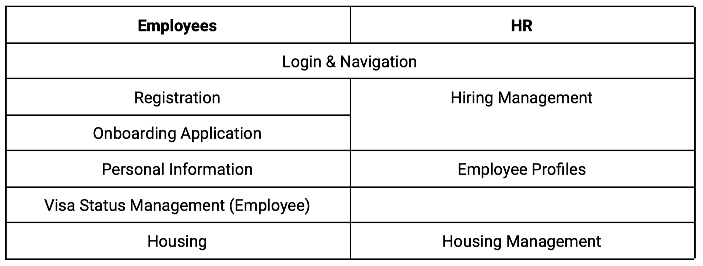
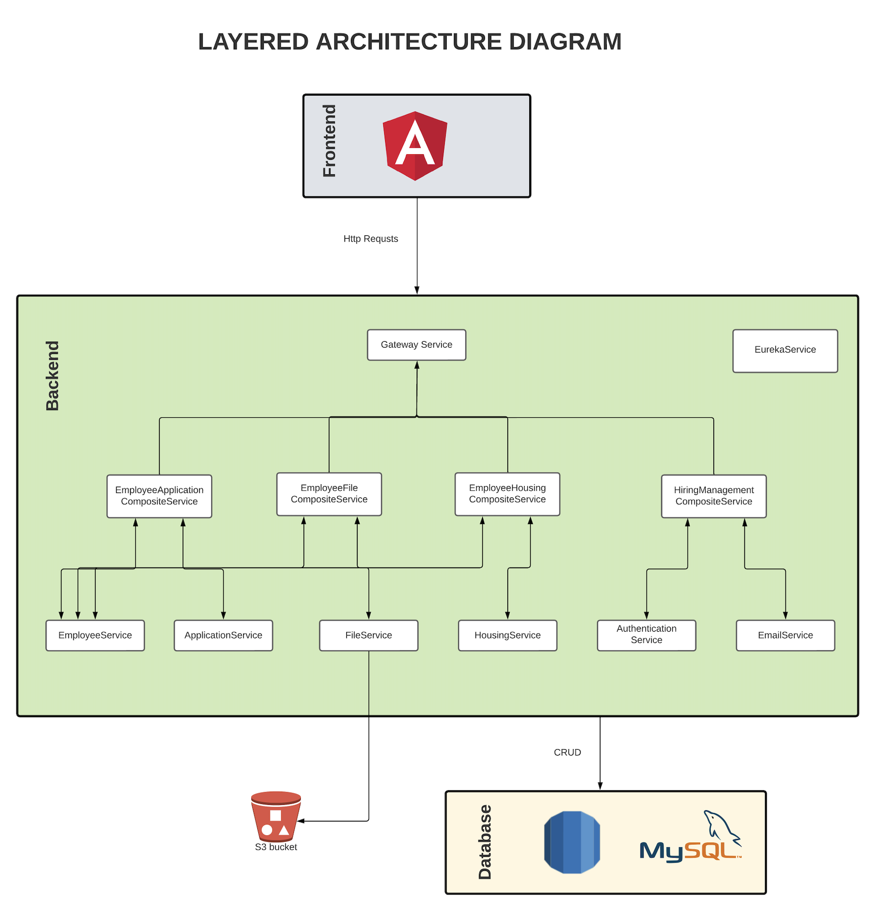
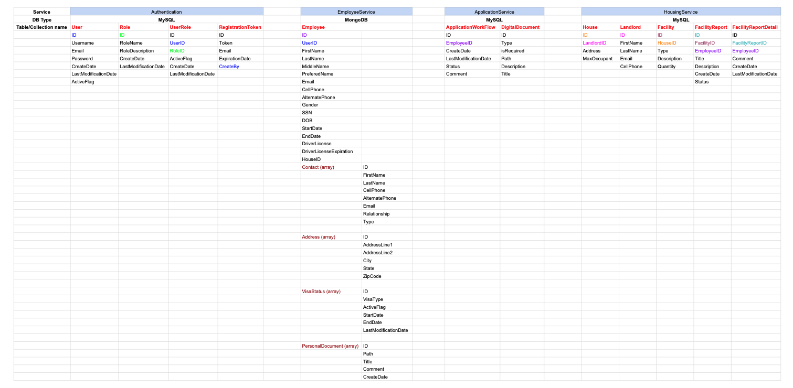
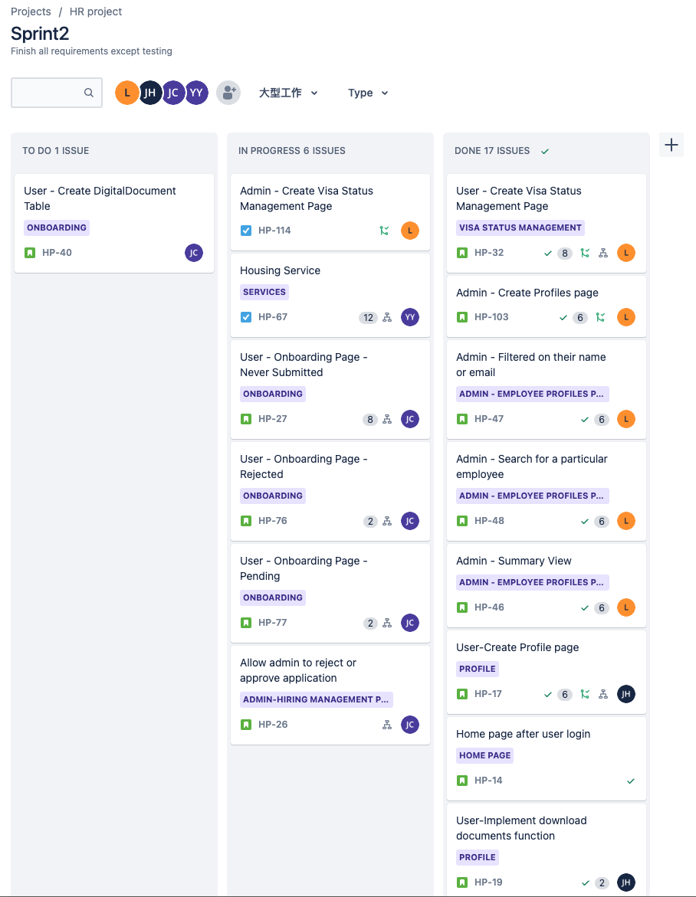

# HR Website Portal

### **Project Description**
---
- In this project, we built a web-based and enterprise-scale property resource application that connects an employee and HR for managing the new employee onboarding process.
- The application serves as a way that employees will be able to update personal information, upload required documents for identification and work authorization, and monitor their housing situation. Meanwhile, HR will be able to access employee information and make changes regarding the onboarding status or housing assignments.
- This project is done by [Ruifeng Luo](https://www.linkedin.com/in/ruifeng-luo/), [Yu-Ming Huang](), [Yu Chen]() and [Yun-Chen Yen]().

### **Requirements**
---
1. This is project is required to implement Frontend and Backend using Angular and Spring Boot.
2. The main application should be built in a microservice architecture, and all communication needs to be done using OpenFeign, RabbitMQ or RestTemplate.
3. All composite Services need to be secureed with Spring Security.
4. Database tables should be created using MySQL and MongoDB on AWS RDS and MongoDB Atlas.
5. All actions related to file storage should be associated with the AWS S3 Buckets.

### **System Requirements**
---

### **Architecture**
---
- Frontend   
This layer contains the user-oriented functionality responsible for managing user interaction with the backend. It also consists of components that provide a communication channel into the services encapsulated in the backend.
- Backend  
This layer implements the core functionality of the main features for the application and encapsulates the main business logic.  

### **Database Design**
---

### **Jira Board**
---

